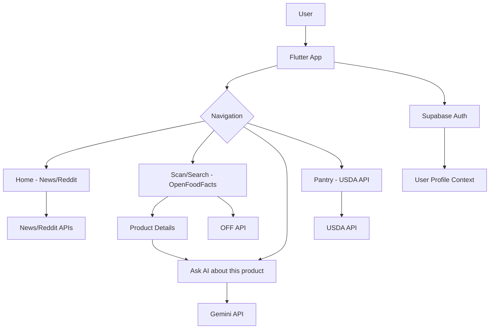

# Safe Eat - System Design Document

## 1. Project Overview
**Safe Eat** is a mobile application designed to help users make healthier and safer food choices. It provides instant product analysis, barcode scanning, personalized AI-driven nutrition advice (Snacky AI), and a pre-shopping pantry builder using various global food databases.

---

## 2. Architecture: Flutter Clean Architecture
The project follows a feature-based Clean Architecture to ensure scalability, testability, and maintainability.

### Layers:
- **Presentation**: UI widgets, screens, and state management (mostly using `StatefulWidget` or `ChangeNotifier`). Uses `flutter_animate` for rich aesthetics.
- **Data**: 
    - **Models**: Data structures for API responses (USDA, OpenFoodFacts, News, Reddit).
    - **Services**: API clients for fetching remote data.
    - **Repositories (Implicit)**: Many services act as simple repositories for now.
- **Core**: Shared utilities, localization, and global constants.

---

## 3. Technology Stack
- **Framework**: [Flutter](https://flutter.dev/) (v3.10.1+)
- **Backend/Database**: [Supabase](https://supabase.com/) (Auth, User Profiles)
- **AI Core**: [Google Gemini Pro Vision](https://aistudio.google.com/) (Generative AI for label analysis)
- **External APIs**:
    - **OpenFoodFacts**: Global barcode and product nutrient data.
    - **USDA FoodData Central**: Food category browsing and alternative discovery.
    - **News API**: Latest trends in food safety and regulations.
    - **Reddit API**: Real-world user reviews of food products.
- **Storage**: `SharedPreferences` (Search history)
- **State Management**: `ValueNotifier` (Locale management), `setState` (Local screen state).

---

## 4. Feature Breakdown

### A. Authentication & Profile
- **Supabase Auth**: Secure email/password login and registration.
- **Safety Profile**: Users input age, weight, height, and allergies. This context is used to personalize AI responses.

### B. High-Fidelity Scanning & Search
- **Visual Scanner**: Uses `mobile_scanner` for fast barcode detection.
- **Manual Entry**: Fallback for damaged barcodes.
- **Search-as-you-type**: Debounced search with skeleton loading and localized results.
- **Search History**: persistent local storage of recent queries.

### C. Snacky AI (Multi-modality)
- **Agentic AI**: A custom system prompt defines "Snacky" as a smart, friendly nutritionist.
- **Vision Integration**: Users can upload/take photos of ingredient labels.
- **Ingredient Breakdown**: Explains complex additives in simple terms (helps vs harms).
- **Safety Verdict**: Provides clear "Safe", "Limit", or "Avoid" conclusions.

### D. Pre-Shopping (Pantry)
- **Category Browsing**: Visual grid of food categories powered by USDA keywords.
- **Shopping List**: Persistent manager to build a list of healthy alternatives before heading to the store.

---

## 5. System Design Diagram (Logical Flow)

---

## 6. Key Implementation Decisions
1. **User-Agent Requirement**: Implemented a global User-Agent for OpenFoodFacts to comply with their TOS and prevent blocking.
2. **Localization**: Entire app supports English, Hindi, and Asomiya using a custom JSON-based `AppLocalizations` system.
3. **Performance**: Integrated debouncing (600ms) for searches to reduce API overhead and implemented skeleton loaders for better perceived performance.
4. **Rich Aesthetics**: Heavy use of `GoogleFonts (Outfit)` and `flutter_animate` to provide a premium, organic feel suitable for a health-focused app.
